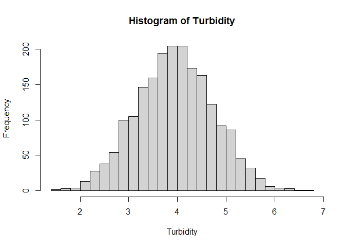
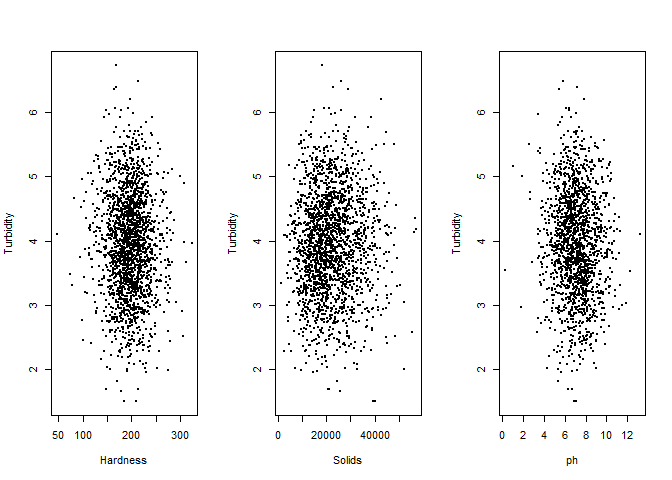
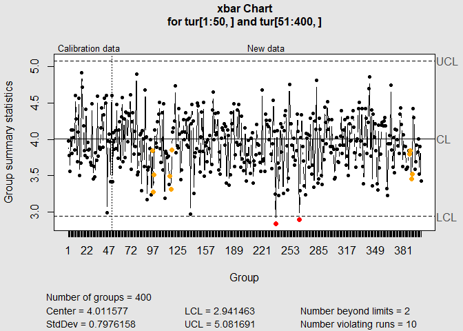
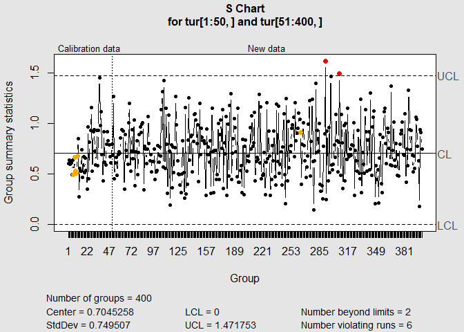
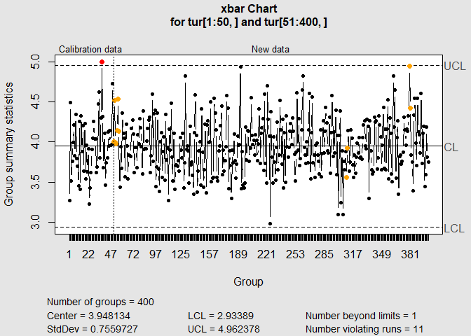
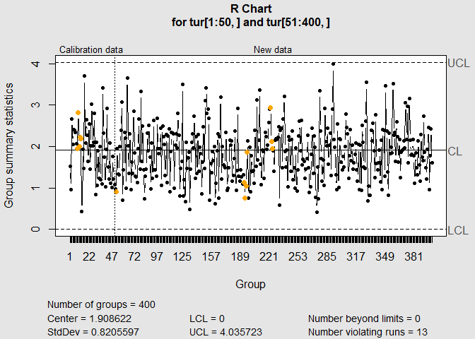
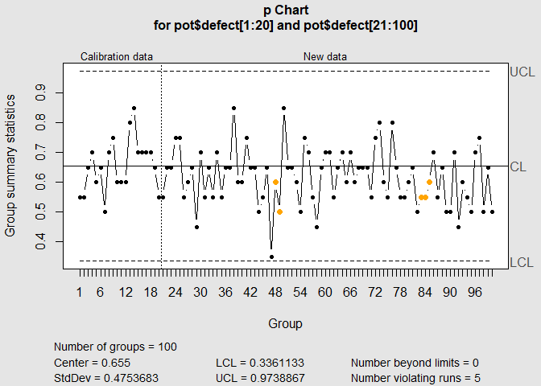
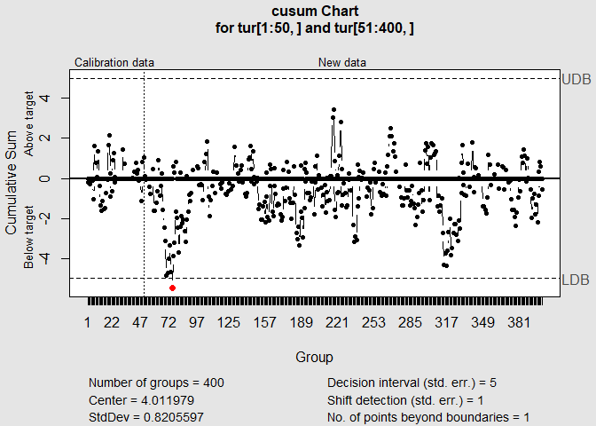
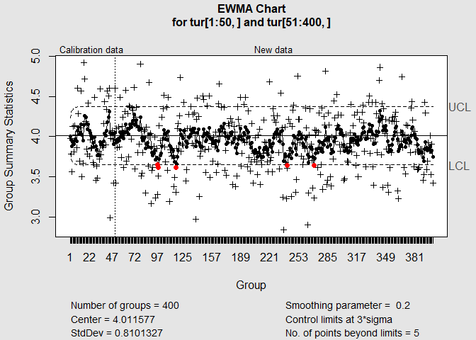

```r
library(qcc)
```

```
## Package 'qcc' version 2.7
```

```
## Type 'citation("qcc")' for citing this R package in publications.
```

```r
setwd("C:/Users/ray98/Desktop/project/class/qc")
dt <- read.csv("water_potability.csv")
dt <- dt[1:2000,]
dt <- dt[sample(2000),]
```

## Data cleaning

```r
# use the Turbidity variable
tur <- dt$Turbidity[1:2000]

# check if there is NA
which(is.na(dt$Turbidity))
```

```
## integer(0)
```

```r
# check the assumptions for control chart
hist(tur, breaks = 20, main = "Histogram of Turbidity", xlab = "Turbidity")
```

<!-- -->

```r
shapiro.test(tur)
```

```
## 
## 	Shapiro-Wilk normality test
## 
## data:  tur
## W = 0.99949, p-value = 0.9036
```

```r
par(mfrow=c(1,3))
plot(dt$Hardness[1:2000], dt$Turbidity[1:2000], pch = 20, cex = 0.5, ylab = "Turbidity", xlab = "Hardness")
plot(dt$Solids[1:2000], dt$Turbidity[1:2000], pch = 20, cex = 0.5, ylab = "Turbidity", xlab = "Solids")
plot(dt$ph[1:2000], dt$Turbidity[1:2000], pch = 20, cex = 0.5, ylab = "Turbidity", xlab = "ph")
```

<!-- -->

## X bar-S chart

```r
tur <- matrix(dt$Turbidity[1:2000], ncol = 5)
par(mfrow=c(1,1))
obj <- qcc(tur[1:50,], type="xbar", newdata=tur[51:400,], std.dev = "UWAVE-SD")
```

<!-- -->

```r
obj <- qcc(tur[1:50,], type="S", newdata=tur[51:400,])
```

<!-- -->

## X bar-R chart

```r
obj <- qcc(tur[1:50,], type="xbar", newdata=tur[51:400,], std.dev = "UWAVE-R")
```

<!-- -->

```r
obj <- qcc(tur[1:50,], type="R", newdata=tur[51:400,])
```

<!-- -->


## p chart

```r
pot <- matrix(dt$Potability[1:2000], ncol = 20)
pot <- as.data.frame(pot)
pot$defect <- 20-rowSums(pot)
pot$size <- 20
with(pot, qcc(pot$defect[1:20], pot$size[1:20], type = "p", newdata=pot$defect[21:100], newsizes=pot$size[21:100]))
```

<!-- -->

```
## List of 15
##  $ call        : language qcc(data = pot$defect[1:20], type = "p", sizes = pot$size[1:20], newdata = pot$defect[21:100],      newsizes = pot$size[21:100])
##  $ type        : chr "p"
##  $ data.name   : chr "pot$defect[1:20]"
##  $ data        : num [1:20, 1] 7 10 12 10 9 15 13 17 8 10 ...
##   ..- attr(*, "dimnames")=List of 2
##  $ statistics  : Named num [1:20] 0.35 0.5 0.6 0.5 0.45 0.75 0.65 0.85 0.4 0.5 ...
##   ..- attr(*, "names")= chr [1:20] "1" "2" "3" "4" ...
##  $ sizes       : num [1:20] 20 20 20 20 20 20 20 20 20 20 ...
##  $ center      : num 0.578
##  $ std.dev     : num 0.494
##  $ newstats    : Named num [1:80] 0.8 0.6 0.65 0.55 0.7 0.7 0.65 0.6 0.55 0.8 ...
##   ..- attr(*, "names")= chr [1:80] "21" "22" "23" "24" ...
##  $ newdata     : num [1:80, 1] 16 12 13 11 14 14 13 12 11 16 ...
##  $ newsizes    : num [1:80] 20 20 20 20 20 20 20 20 20 20 ...
##  $ newdata.name: chr "pot$defect[21:100]"
##  $ nsigmas     : num 3
##  $ limits      : num [1:100, 1:2] 0.246 0.246 0.246 0.246 0.246 ...
##   ..- attr(*, "dimnames")=List of 2
##  $ violations  :List of 2
##  - attr(*, "class")= chr "qcc"
```

## CUSUM chart

```r
q <- cusum(tur[1:50,], newdata=tur[51:400,], se.shift = 1)
```

<!-- -->

## EWMA chart

```r
q <- ewma(tur[1:50,], lambda=0.2, nsigmas=3, newdata=tur[51:400,]) 
```

<!-- -->

